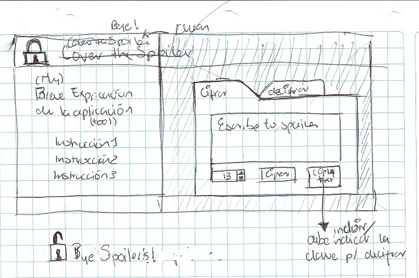
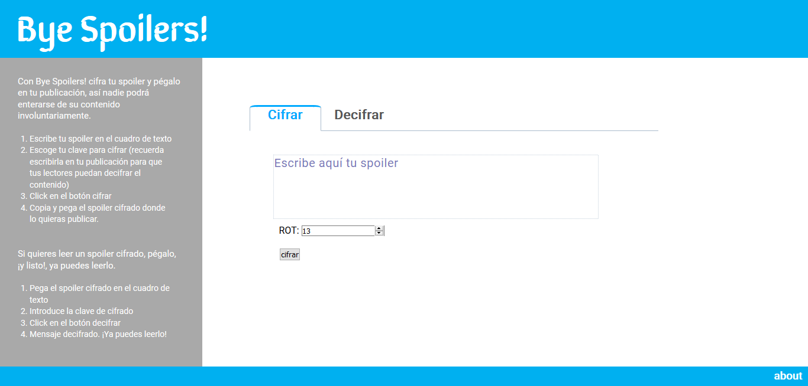

# Bye Spoilers!
¿Cuántas veces has querido comentar en twitter lo que pasó en el último capítulo de tu serie favorita, pero te has detenido para que no te reclamen los que aún no lo han visto?, o ¿no has querido expresar en línea tu frustración sobre el final de la película que viste, pero sabes que si lo haces revelarías casi toda la trama?

La solución simple a estos problemas es escribir:

:no_entry: :no_entry_sign: SPOILER ALERT :exclamation: :collision: :bomb: :
       
        ....pero lo acaban leyendo 

        y enojándose contigo 

Con Bye Spoilers! Cifras tu spoiler en nuestra aplicación y lo pegas en tu publicación, así nadie podrá enterarse de su contenido involuntariamente. Si quieres leerlo, tienes que ingresar el spoiler cifrado en la aplicación, ¡y listo!, ya puedes leerlo.

## ¿Cómo funciona?
### Cifrar spoiler
1. Ingresa a [Bye Spoiler!](https://isislazaro.github.io/MEX-008-Cipher/src/)
2. Escribe tu spoiler en el cuadro de texto
3. Escoge tu clave para cifrar (recuerda escribirla en tu publicación para que tus lectores puedan decifrar el contenido)
4. Click en el botón cifrar
5. Copia y pega el spoiler cifrado donde lo quiera publicar.
### Decifrar spoiler (Aún sin implementar)
1. Ingresa a [Bye Spoiler!](https://isislazaro.github.io/MEX-008-Cipher/src/)
2. Pega el spoiler cifrado en el cuadro de texto
3. Introduce la clave de cifrado
4. Click en el botón decifrar
5. Mensaje decifrado.
## Definición de Producto
Los principales usuarios de Bye Spoilers! son aquellas personas que les gusta comentar en línea sobre lo que sucedió en el último capítulo de su serie favorita, dar sus teorías del final de la última película que vieron, o comentar sobre la trama del libro que están leyendo, pero saben que lo que escriben puede molestar y dañar la experiencia de otros que aún no han podido ponerse al día sobre lo que están hablando, por lo que quieren escribir libremente, sin preocuparse de ello.

Bye Spoilers! resuelve este problema dándole al usuario una herramienta que le permite escribir spoilers cifrados, para que sólo las personas interesadas puedan leerlas. Y al lector curioso le da la oportunidad de decidir si lo quiere leer o no, decifrandolos mediante Bye Spoilers!.

## Marco de trabajo
Crear una aplicación web para que el usuario pueda cifrar y descifrar un texto, indicando un desplazamiento específico de caracteres (offset) utilizando un alfabeto simple.
### Product Backlog
1. Definición del producto
  - Quiénes son los principales usuarios de producto
  - Cuáles son los objetivos de estos usuarios en relación con tu producto.
  - Cómo crees que el producto que estás creando está resolviendo sus problemas.
2. Interfaz de usuario
  - Elegir un desplazamiento (offset), indicando cuántas posiciones queremos que el cifrado desplace cada carácter :heavy_check_mark:
  - Insertar un mensaje (texto) que queremos cifrar :heavy_check_mark:
  - Ver el resultado del mensaje cifrado :heavy_check_mark:
  - Insertar un mensaje (texto) a descifrar
  - Ver el resultado del mensaje descifrado
3. Hacker edition
  - Manejo letras minúsculas y otros caracteres
  - Offset negativo
  - Modelo de negocios
### Sprint 1
#### Objetivo
Definir el producto a trabajar, y programar una interfaz de usuario funcional, que cifre un texto y lo muestre al usuario.
#### Sprint 1 Backlog
1. Definición del producto
  - IDEA
  - Quiénes son los principales usuarios de producto
  - Cuáles son los objetivos de estos usuarios en relación con tu producto
  - Cómo crees que el producto que estás creando está resolviendo sus problemas
  - Escribir README
2. Interfaz de usuario funcional
  - Inicializar proyecto :heavy_check_mark:
    - Instalar editor de texto
    - Shell (terminal) instalada
    - Fork proyecto
    - Clonar fork (+ los 2 links a entregrar al finalizar el sprint)
    - npm install
    - npm run
  - Implementar cipher y pasar pruebas (cipher.js) :heavy_check_mark:
    - programar fórmula cifrado césar ascii
    - cifrar mayúsculas e ignorar los otros caracteres
    - implementarla en la función encode(offset, string)
    - crear objeto cipher con metódo encode  y exportarlo al objeto globlal (window)
    - correr tests
  - Estructura base de la interfaz (index.html) :heavy_check_mark:
    - crear formulario (form): 
      - textarea: Área donde el usuario va a escribir el texto a cifrar y aparecerá el texto cifrado. Es obligatorio escribir un texto
      - entrada tipo numérico: Espacio donde el usuario va a colocar el offset. Números positivos y también es obligatorio ingresar este dato.
      - botón tipo submit: Genera acción de cifrar.
  - Vincular datos introducidos en el formulario con la función cifrar (index.js) :heavy_check_mark:
    - obtener texto introducido por el usuario
    - obtener valor del offset seleccionado por el usuario
    - al hacer click en el botón tipo submit llamar a la función cipher y pasarle los valores de texto y ofset.
    - mostrar texto cifrado en textarea
  - Styling (CSS) :x:

### Sprint 2
#### Objetivo Sprint 2
#### Sprint 2 Backlog
1. Interfaz de usuario
  - programar fórmula decifrado
  - Insertar un mensaje (texto) a descifrar
  - Ver el resultado del mensaje descifrado
2. Mejorar integración del diseño
3. Hacker edition
## Diseño UX
### Descubrimiento e investigación
### Síntesis y definición
### Ideación
### Prototipado
Sketch en papel

Descripción: 

En la versión web se busca una interfaz de usuario simple, fácil de entender para quien accede por primera vez, pero no tan saturada de infomación para el usuario cotidiano; que contenga toda la información y las herramientas necesarias para realizar el cifrado en una sola pantalla. Se accederá a la parte de decifrado haciendo click en la pestaña correspondiente, e igualmente las instrucciones y herramientas estarán en una sola pantalla. 

El usuario tendrá que introducir el texto y el offset obligatoriamente para poder cifrar/decifrar la información. También se limitara a que el dato que introduzca como offset sea un número entero mayor que cero.

Versión final de la interfaz de usuario:

## Referencias
[README original](READMEoriginal.md)
